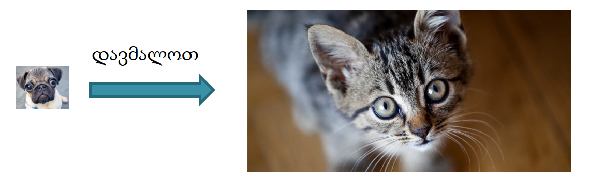
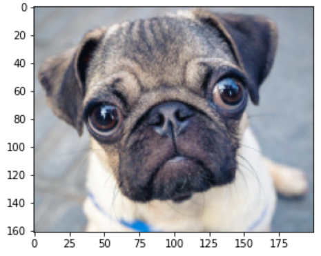
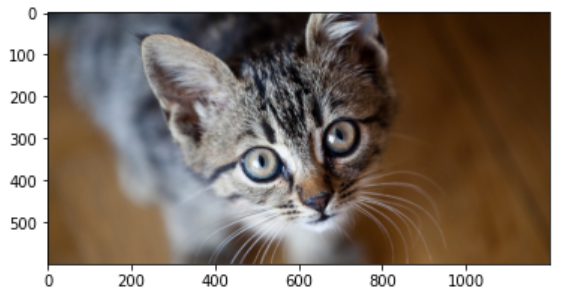
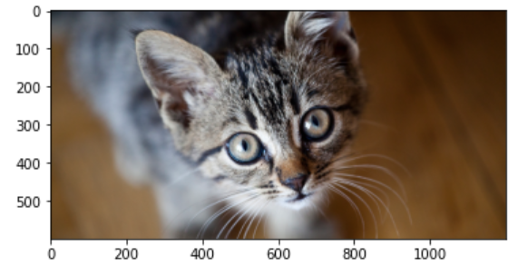

<!-- README.ge.md (Georgian) -->

# სტეგანოგრაფია
პაატა გოგიშვილი

For The English Version click here<br/>
- [English](./README.md)

## განმარტება

სტეგანოგრაფია არის შეტყობინების, ფაილის ან სხვა სახის ინფორმაციის დამალვა სხვა ობიექტში ან შეტყობინებაში ისე, რომ ფარული ინფორმაციის არსებობა არ იყოს აშკარა. სტეგანოგრაფია ხშირად გამოიყენება მგრძნობიარე მონაცემების დასაცავად ან შეტყობინებების საიდუმლოდ გადასაცემად.

სიტყვა სტეგანოგრაფია მომდინარეობს ბერძნული სიტყვებიდან "steganos", რაც ნიშნავს "დაფარულს" და "graphia", რაც ნიშნავს "წერას". სტეგანოგრაფია სათავეს იღებს უძველესი დროიდან. ადამიანები იყენებდნენ სხვადასხვა მეთოდს, რათა დაემალათ შეტყობინებები ყოველდღიურ საგნებში ან ნახატებში. მაგალითად ხანდახან ინფორმაციას გაპარსულ თავებზე სვირინგებში მალავდნენ.

თანამედროვე დროში სტეგანოგრაფია ხშირად გამოიყენება ციფრულ მედიაში, როგორიცაა სურათები, აუდიო და ვიდეო ფაილები. მაგალითად, ერთი გავრცელებული ტექნიკაა შეტყობინების ჩასმა სურათის ან აუდიო ფაილის ყველაზე ნაკლებად მნიშვნელოვან ბიტებში. ეს ტექნიკა ხშირად გამოიყენება საავტორო უფლებების შესახებ ინფორმაციის დასამალად ან ინფორმაციის ფარულად გადასაცემად.

## პრაქტიკული მაგალითი

ვთქვათ გვინდა სურათის დამალვა. ამისთვის შეიძლება გამოვიყენოთ მეორე, უფრო დიდი სურათი.

ვთქვათ გვინდა დავმალოთ ძაღლის სურათი კატის შედარებით მოზრდილ სურათში.



დასამალად შეგვიძლია ძაღლის სურათის წერტილები (მათი რიცხობრივი მნიშვნელობების მცირე ფრაგმენტებიც კი) მეჩხერად გადავანაწილოთ კატის სურათში.

დავუშვათ, რომ ძაღლის სურათის პირველი პიქსელი არის ($\color{red}{\text{145}}$, $\color{green}{\text{156}}$, $\color{blue}{\text{165}}$). ორობითში გვექნება ($\color{red}{\text{10010001}}$, $\color{green}{\text{10011100}}$, $\color{blue}{\text{10100101}}$). ამ რიცხვების დამალვა შეგვიძლია თუ კატის სურათში რამდენიმე პიქსელის ფერებს ოდნავ შევცვლით. “ოდნავ” ნიშნავს ფერის ისეთ ცვლილებას, რომელიც შეუმჩნეველი დარჩება ადამიანის თვალისთვის. ავიღოთ კატის სურათის 4 პიქსელი და მათი თითოეული ფერის ბოლო 2 თანრიგი შევცვალოთ ძაღლის პიქსელის თანრიგებით. ეს არის კატის პიქსელები შეცვლამდე (00101100, 00110001, 00111000) (00100010, 00100110, 00101100) (00011111, 00100001, 00101010) (00100001,  00100100, 00101110) ეს კი კატის შეცვლილი სურათის პიქსელებია (001011 $\color{red}{\text{10}}$, 001100 $\color{red}{\text{01}}$, 001110 $\color{red}{\text{00}}$) (001000 $\color{red}{\text{01}}$, 001001 $\color{green}{\text{10}}$, 001011 $\color{green}{\text{01}}$) (000111 $\color{green}{\text{11}}$, 001000 $\color{green}{\text{00}}$, 001010 $\color{blue}{\text{10}}$) (001000 $\color{blue}{\text{10}}$,  001001 $\color{blue}{\text{01}}$, 001011 $\color{blue}{\text{01}}$).

ანალოგიურად შეგვიძლია დავმალოთ ძაღლის სურათის სხვა პიქსელებიც.

ამგვარად, ძაღლის სურათის ინფორმაცია კატის სურათის 4-ჯერ მეტ ფართზე გადანაწილდება და თვალისთვის შეუმჩნეველი იქნება.

## პითონის კოდი
ჩავტვირთოთ საჭირო ბიბლიოთეკები

```Python
from PIL import Image
import matplotlib.pyplot as plt
import numpy as np
```

თუ პროგრამის გაშვება გვსურს გუგლის colab-ით, ჯერ drive-თან დავამყაროთ კავშირი და შემდეგ წავიკითხოთ სურათები. თუ პროგრამის გაშვებას ლოკალურად ვგეგმავთ, ეს სექცია უნდა გამოვტოვოთ!

წავიკითხოთ საიდუმლო და საჯარო სურათები ფაილებიდან.

```Python
from google.colab import drive

# მივაერთოთ გუგლის დრაივის დისკი
drive.mount('/content/drive')

# წავიკითხოთ სურათები
public_img = np.asarray(Image.open('drive/MyDrive/Cyber/cat.png')).copy()
secret_img = np.asarray(Image.open('drive/MyDrive/Cyber/dog.png')).copy()
```

თუ წინა სექცია გამოვტოვეთ, ანუ თუ ლოკალურად გვაქვს პროგრამა გაშვებული, მხოლოდ მაშინ დაგვჭირდება შემდეგი სექციის გაშვება, იმისთვის, რომ წავიკითხოთ საიდუმლო და საჯარო სურათები ფაილებიდან.

```Python
public_img = np.asarray(Image.open('pictures/cat.png')).copy()
secret_img = np.asarray(Image.open('pictures/dog.png')).copy()
```

ვაჩვენოთ საიდუმლო სურათი ეკრანზე. გაითვალისწინეთ, რომ სურათის საჩვენებელი ზომა (რომელსაც ეკრანზე ვხედავთ) ავტომატურად შეარჩია ბიბლიოთეკის ფუნქციამ და არ შეესაბამება რეალურ ზომას. სურათის წერტილების რაოდენობის დასადგენად უნდა ვისარგებლოთ ღერძებზე მიწერილი რიცხვებით. ჩვენს შემთხვევაში ეს მოსახერხებელიც კი არის, რადგან ძაღლის სურათი მომცროა და უკეთ დასანახად გადიდება არაა ურიგო გამოსავალი.

```Python
# ვაჩვენოთ საიდუმლო სურათი
plt.imshow(secret_img)
plt.show()
```


საიდუმლო სურათის მსგავსად, ზომა ავტომატურად შეარჩია ბიბლიოთეკის ფუნქციამ. სურათის წერტილების რაოდენობის დასადგენად უნდა ვისარგებლოთ ღერძებზე მიწერილი რიცხვებით.

```Python
# ვაჩვენოთ საჯარო სურათი
plt.imshow(public_img)
plt.show()
```



მოვამზადოთ სამუშაო ფუნქციები.
- `hide_image` და `unhide_image` არის ის ძირითადი ფუნქციები, რომლითაც ხდება სურათის დამალვა და მისი აღდგენა.
- `get_pixel` და `set_pixel` ფუნქციები უშუალოდ სურათის მასივებთან მუშაობის საშუალებას გვაძლევს. მათი საშუალებით შესაძლებელია სურათის კონკრეტული $(x, y)$ კოორდინატების მქონე პიქსელის ნახვაც და შეცვლაც.
- დამხმარე მიზნებისთვის არის შემოღებული ფუნქცია `hide_pixel`, რომლის დანიშნულებაა ერთი წერტილის დამალვა. ამ ფუნქციას მუშაობისთვის სჭირდება დასამალი წერტილის ფერების მდგენელების დაშლა თანრიგებად (რასაც `chop` ფუნქცია ასრულებს) და ამ თანრიგების შერწყმა საჯარო სურათთან (რისთვისაც `merge` ფუნქცია არის შექმნილი).

```Python
# ერთი წერტილის მიღება სურათიდან
def get_pixel(img, x, y):
  return img[x, y]


# ერთი წერტილის ჩაწერა სურათში
def set_pixel(img, x, y, r, g, b):
  img[x, y, 0] = r
  img[x, y, 1] = g
  img[x, y, 2] = b


# ერთი ფერის დანაწევრება 2 ბიტიან ფრაგმენტებად
def chop(c):
  return c >> 6, (c & 48) >> 4, (c & 12) >> 2, (c & 3)


# ფერის ფრაგმენტის შერწყმა საჯარო სურათთან
def merge(part, img, x, y, channel):
  pix = get_pixel(img, x, y)
  pix[channel] = (pix[channel] >> 2 << 2) | part

    
# საიდუმლო სურათის წერტილის დამალვა საჯარო სურათში
def hide_pixel(s_img, p_img, x, y, dx = 0, dy = 0):
  z = 4*y

  s_pixel = get_pixel(s_img, x, y)

  r = s_pixel[0]
  g = s_pixel[1]
  b = s_pixel[2]

  r1, r2, r3, r4 = chop(r)
  g1, g2, g3, g4 = chop(g)
  b1, b2, b3, b4 = chop(b)

  merge(r1, p_img, x + dx, z + dy,     0)
  merge(r2, p_img, x + dx, z + dy,     1)
  merge(r3, p_img, x + dx, z + dy,     2)
  merge(r4, p_img, x + dx, z + dy + 1, 0)

  merge(g1, p_img, x + dx, z + dy + 1, 1)
  merge(g2, p_img, x + dx, z + dy + 1, 2)
  merge(g3, p_img, x + dx, z + dy + 2, 0)
  merge(g4, p_img, x + dx, z + dy + 2, 1)

  merge(b1, p_img, x + dx, z + dy + 2, 2)
  merge(b2, p_img, x + dx, z + dy + 3, 0)
  merge(b3, p_img, x + dx, z + dy + 3, 1)
  merge(b4, p_img, x + dx, z + dy + 3, 2)


# საიდუმლო სურათის დამალვა საჯარო სურათში
def hide_image(s_img, p_img, dx = 0, dy = 0):
  for i in range(np.shape(s_img)[0]):
    for j in range(np.shape(s_img)[1]):
      hide_pixel(s_img, p_img, i, j, dx, dy)


# საიდუმლო სურათის ამოღება საჯარო სურათიდან
def unhide_image(p_img, w, h, dx = 0, dy = 0):
  unhided = np.zeros((h, w, 3), dtype='uint8')
  for i in range(h):
    for j in range(w):
      p1 = get_pixel(p_img, dx + i, dy + 4 * j)
      p2 = get_pixel(p_img, dx + i, dy + 4 * j + 1)
      p3 = get_pixel(p_img, dx + i, dy + 4 * j + 2)
      p4 = get_pixel(p_img, dx + i, dy + 4 * j + 3)

      r: np.uint8 = ((p1[0] & 3) << 6) | ((p1[1] & 3) << 4) | ((p1[2] & 3) << 2) | (p2[0] & 3)
      g: np.uint8 = ((p2[1] & 3) << 6) | ((p2[2] & 3) << 4) | ((p3[0] & 3) << 2) | (p3[1] & 3)
      b: np.uint8 = ((p3[2] & 3) << 6) | ((p4[0] & 3) << 4) | ((p4[1] & 3) << 2) | (p4[2] & 3)

      set_pixel(unhided, i, j, r, g, b)

  return unhided
```

ზემოთ გამზადებული ფუნქციის გამოყენებით, დავმალოთ საიდუმლო სურათი საჯაროში და ვუჩვენოთ მიღებული სურათი ეკრანზე

```Python
# დავმალოთ საიდუმლო სურათი საჯაროში
hide_image(secret_img, public_img, 0, 0)

# ვაჩვენოთ ეკრანზე საჯარო სურათი, სადაც უკვე დამალულია საიდუმლო სურათი
plt.imshow(public_img)
plt.show()
```



როგორც ვხედავთ, სურათს საერთოდ არ ეტყობა, რომ შეცვლილია! ეს ნიშნავს, რომ ჩვენი მეთოდი კარგად უმკლავდება დაკისრებულ ამოცანას.

ახლა დროა დამალული სურათი ამოვიღოთ.
 
გამოვიყენოთ ჩვენ მიერ მომზადებული ფუნქცია, ამოვიღოთ ძაღლის სურათი და ვუჩვენოთ ეკრანზე.

```Python
# ამოვიღოთ დამალული სურათი
unhided = unhide_image(public_img, 200, 161, 0, 0)

# ვაჩვენოთ ამოღებული სურათი ეკრანზე
plt.imshow(unhided)
plt.show()
```


სურათი წარმატებით ამოვიღეთ!

## Contact
paatagog@gmail.com
